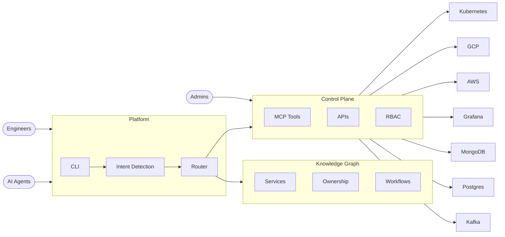

# CLISREP

**CLI SRE Platform** — one stop solution for all your cloud doubts.

## Architecture



## Phase 1: Analysis — Complete

| | |
|---|---|
| **Jira tickets (6mo)** | ~1,496 |
| **Slack messages** | 924 |
| **Automatable/month** | ~53 tickets (~106 eng-hours saved) |
| **Top workload** | DB ops 31%, Secrets 15%, Deployments 12% |
| **Key insight** | 82% of Slack requests never become tickets |

## Run

```sh
python pipeline/run.py
```

S1 Gather → S2 Analyze → S3 Generate (KG + Dashboard)

## Structure

```
pipeline/           # Reproducible 3-stage pipeline
data/raw/           # Jira + Slack source dumps
data/analyzed/      # Structured analysis JSON
knowledge-graph/    # Maintainable YAML (categories, ownership, workflows, APIs, schema)
dashboard.html      # Self-contained leadership dashboard
```
