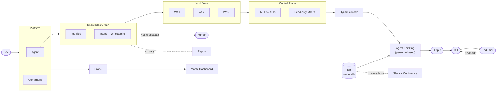

# CLISREP

**CLI SRE Platform** — one stop solution for all your cloud doubts.

## Architecture



## Phase 1: Analysis — Complete

| | |
|---|---|
| **Jira tickets (6mo)** | ~1,496 |
| **Slack + Jira real requests** | 1,046 classified |
| **Automatable** | 61% (640 requests routable to handlers) |
| **Top intents** | provision_datastore 14%, rotate_secret 10%, grant_permission 7% |
| **Coverage** | 79% routed to specific intents (21% catch-all) |

## Next Steps

1. **Build 2 workflows** — `provision_datastore` and `rotate_secret` (highest volume intents)
2. **Build the Knowledge Graph** — repo-based `.md` files with intent-to-workflow mapping, daily cron updates
3. **KB (vector-db)** — ingest Slack + Confluence for knowledge questions, hourly cron sync

## Run

```sh
python pipeline/run.py
```

S1 Gather → S2 Analyze → S3 Generate (KG + Dashboard)

## Structure

```
pipeline/           # Reproducible 3-stage pipeline
data/raw/           # Jira + Slack source dumps
data/analyzed/      # Structured analysis + intent classification
knowledge-graph/    # Maintainable YAML (categories, ownership, workflows, APIs)
cc-dashboard.html   # Intent-based dashboard (presentation)
dashboard.html      # Domain-based dashboard (detailed)
```
